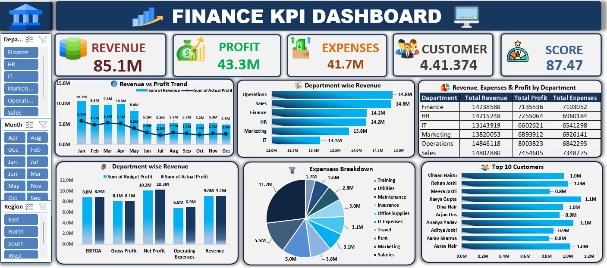

# 📊 Finance KPI Dashboard | Excel

## Project Overview

This project presents an interactive *Finance KPI Dashboard developed in Microsoft Excel* to analyse revenue, profit, expenses, customer volume, customer score, department performance, expense categories, and customer contribution.

The dashboard is designed to provide a clear and interactive view of business performance using Excel-based data analysis and visualization techniques.

## Dashboard Preview

The dashboard provides an interactive interface where users can filter the analysis using Department, Month, and Region slicers and dynamically explore different aspects of performance.

## Key Performance Indicators

The dashboard includes the following key business metrics:

- Revenue
- Profit
- Expenses
- Customers
- Score

The dashboard currently displays:

- **Revenue:** 85.1M
- **Profit:** 43.3M
- **Expenses:** 41.7M
- **Customers:** 4,41,374
- **Score:** 87.47

These are the values visible in the provided dashboard image. They may change based on slicer selections or when the source data is refreshed. Add the currency and the definition of “Score” if these are specified in the workbook.

## Dashboard Features

### 1. Revenue vs. Profit Trend

A monthly trend chart compares revenue and profit from January to December to show how the two measures change over the year.

### 2. Department-wise Revenue

A bar chart compares revenue across Operations, Sales, Finance, HR, Marketing, and IT.

### 3. Department Performance Summary

A table presents total revenue, total profit, and total expenses for each department.

### 4. Department-wise Financial Metric Comparison

A column chart compares Budget Revenue and Actual Profit across financial metrics, including EBITDA, Gross Profit, Net Profit, Operating Expenses, and Revenue, as labelled in the dashboard.

### 5. Expenses Breakdown

A pie chart displays the expense distribution across categories such as salaries, marketing, rent, travel, IT expenses, office supplies, insurance, maintenance, utilities, and training.

### 6. Top 10 Customers

A bar chart ranks the top 10 customers by the measure shown in the dashboard.

### 7. Interactive Slicers

The dashboard contains interactive slicers for:

- Department
- Month
- Region

These slicers allow users to filter the dashboard and analyse selected business segments.

## Tools & Technologies

- Microsoft Excel
- Pivot Tables 
- Pivot Chart
- Slicers
- Excel formulas
- Data cleaning and analysis
- Data visualization

## Business Questions Addressed

This dashboard helps answer questions such as:

- What are the overall revenue, profit, expenses, customer, and score figures?
- How do revenue and profit change month by month?
- Which departments generate the highest revenue?
- How do revenue, profit, and expenses compare across departments?
- Which expense categories account for the largest portions of expenses?
- Which customers rank among the top 10 by the displayed measure?
- How do results change when filtering by department, month, or region?

## Key Insights

The dashboard provides visibility into:

- Overall financial and customer KPIs
- Monthly revenue and profit trends
- Revenue distribution across departments
- Department-level revenue, profit, and expense comparisons
- Expense category contribution
- Customers with the highest displayed measure
- Performance across selected departments, months, and regions

Add specific conclusions here after reviewing the workbook data and testing the slicers. The screenshot alone does not establish which month, department, region, or customer is the overall leader under every filter selection.

## Project Objective

The primary objective of this project is to demonstrate how *Microsoft Excel can be used to transform business data into an interactive management dashboard*.

The dashboard is designed to support data-driven decision-making by presenting important business metrics and trends in a simple and easy-to-understand format.

## Dashboard Structure

The dashboard consists of:

1. KPI Section
2. Revenue vs. Profit Trend
3. Department-wise Revenue
4. Department Performance Summary
5. Department-wise Financial Metric Comparison
6. Expenses Breakdown
7. Top 10 Customers
8. Department, Month, and Region Slicers

## Skills Demonstrated

This project demonstrates practical skills in:

- Excel Dashboard Development
- Data Analysis
- KPI Reporting
- Data Visualization
- Interactive Reporting
- Business Performance Analysis
- Financial Data Presentation

## Conclusion

The Finance KPI Dashboard provides an interactive and visual approach to analysing business performance.

By combining KPI cards, charts, a department summary table, and slicers, the dashboard turns business data into a structured reporting view that can help managers review financial performance and customer measures.

## Author

**Subhash Jadhav**  
Aspiring MIS Executive | Excel & Data Analytics

